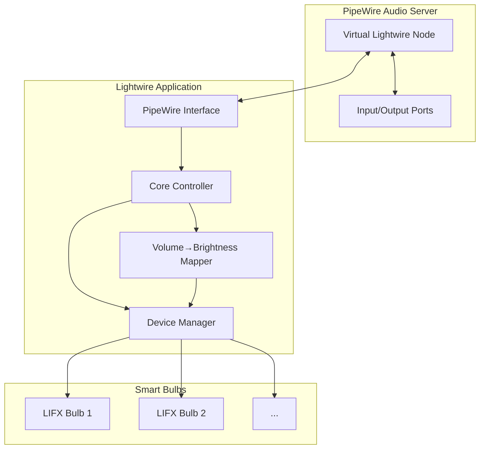

# Lightwire Design Document

## Overview

Lightwire is a Rust tool that creates a virtual PipeWire audio node whose volume controls the brightness of connected smart bulbs. The system acts as a bridge between PipeWire's audio routing capabilities and smart home lighting control.

### Core Concept

Audio volume changes on a virtual PipeWire node are translated to brightness changes on smart bulbs, enabling audio-reactive lighting effects and intuitive control through audio applications.

---

## Architecture

### System Components



### Module Organization

```
lightwire/
├── Cargo.toml                 # Workspace root
├── lightwire/                 # Core application crate
│   ├── src/
│   │   ├── main.rs           # CLI entry point
│   │   ├── core.rs           # Core controller
│   │   ├── pipewire.rs       # PipeWire interface
│   │   ├── devices.rs        # Device management
│   │   ├── mapping.rs        # Volume→brightness mapping
│   │   └── config.rs         # Configuration handling
│   └── Cargo.toml
├── lightwire-lifx/            # LIFX device provider
│   ├── src/
│   │   ├── lib.rs            # Provider trait implementation
│   │   ├── discovery.rs       # LIFX LAN discovery
│   │   ├── control.rs        # Brightness control
│   │   └── protocol.rs       # LIFX protocol helpers
│   └── Cargo.toml
└── lightwire-pw/              # PipeWire integration (optional)
    ├── src/
    │   ├── lib.rs
    │   ├── node.rs           # Virtual node creation
    │   └── stream.rs         # Audio stream handling
    └── Cargo.toml
```

---

## PipeWire Integration

### Virtual Node Design

Lightwire creates a virtual audio sink node in PipeWire that:
- Accepts audio input from any application
- Provides volume control properties
- Emits volume change events
- Optionally consumes audio (for visualizer purposes)

### Node Properties

```
node.name = "lightwire"
node.description = "Lightwire Smart Bulb Control"
media.class = "Audio/Sink"
audio.channels = 2
audio.position = [FL, FR]
```

### Volume→Brightness Mapping

Volume range: `0.0` to `1.0`
Brightness range: `0.0` to `1.0`

**Mapping Modes:**
1. **Linear**: `brightness = volume`
2. **Exponential**: `brightness = volume²` (more natural perceptual response)
3. **Logarithmic**: `brightness = log10(volume * 9 + 1)`

**Hysteresis**: Implement 1-2% threshold to prevent rapid flickering from small volume changes.

### Using pipewire-native-rs

```rust
// Core initialization
let main_loop = MainLoop::new(&props)?;
let context = Context::new(&main_loop, props)?;
let core = context.connect(None)?;

// Create virtual sink node (future feature, may need custom implementation)
// For now: monitor existing nodes and their volume properties
```

**Current Limitation**: pipewire-native-rs doesn't yet support creating virtual nodes. Options:
1. Wait for feature implementation
2. Use libpipewire FFI bindings (pipewire-rs crate)
3. Spawn `pactl load-module` to create virtual sink
4. Use external process (wireplumber/pipewire-cli)

**Recommended Approach**: Use `pactl load-module module-null-sink` via shell to create sink, then monitor it via pipewire-native-rs.

---

## Device Providers

### Provider Trait

```rust
pub trait DeviceProvider: Send + Sync {
    type Device: Device;
    type Error: std::error::Error;

    fn discover(&self) -> Result<Vec<Self::Device>, Self::Error>;
    fn set_brightness(&self, device: &Self::Device, brightness: f32) -> Result<(), Self::Error>;
    fn get_brightness(&self, device: &Self::Device) -> Result<f32, Self::Error>;
}

pub trait Device: Clone + Send + Sync {
    fn id(&self) -> &str;
    fn name(&self) -> &str;
    fn supports_brightness(&self) -> bool;
    fn supports_color(&self) -> bool;
}
```

### LIFX Provider Implementation

#### Using lifx-core

**Dependencies:**
```toml
lifx-core = "0.4"
tokio = { version = "1", features = ["net", "time"] }
```

**Discovery Protocol:**
1. Create UDP socket bound to port 56700
2. Broadcast `Message::GetService` to 255.255.255.255:56700
3. Collect responses with device information
4. Parse device labels, capabilities, etc.

**Brightness Control:**
- Send `Message::SetPower` for on/off
- Send `Message::SetColor` with HSBK values
- Brightness is the K (Kelvin) component for white bulbs, or brightness in HSBK for color bulbs
- Response acknowledgment indicates success

**Async Implementation:**
```rust
pub struct LifxProvider {
    socket: Arc<UdpSocket>,
    timeout: Duration,
}

impl LifxProvider {
    pub async fn discover(&self) -> Result<Vec<LifxDevice>, LifxError> {
        let message = Message::GetService;
        let packet = message.build();
        
        self.socket.send_to(&packet, "255.255.255.255:56700")?;
        
        let mut devices = vec![];
        let deadline = tokio::time::Instant::now() + self.timeout;
        
        while tokio::time::Instant::now() < deadline {
            let mut buf = [0u8; 128];
            let (len, addr) = tokio::time::timeout(
                self.timeout,
                self.socket.recv_from(&mut buf)
            ).await??;
            
            if let Ok(response) = Message::parse(&buf[..len]) {
                if let Message::StateService(service) = response {
                    devices.push(LifxDevice::new(addr, service));
                }
            }
        }
        
        Ok(devices)
    }

    pub async fn set_brightness(&self, device: &LifxDevice, brightness: f32) -> Result<(), LifxError> {
        let hsbk = HSBK {
            hue: device.current_hue,
            saturation: device.current_saturation,
            brightness: brightness,
            kelvin: device.current_kelvin,
        };
        
        let message = Message::SetColor {
            hsbk,
            duration: 0, // Immediate
        };
        
        self.socket.send_to(&message.build(), device.address)?;
        Ok(())
    }
}
```

### Future Providers

- **Hue Provider**: Philips Hue bridges (HTTP API)
- **Yeelight Provider**: Yeelight LAN protocol
- **MQTT Provider**: Generic MQTT-based devices
- **Home Assistant Provider**: Via Home Assistant API

---

## Core Controller

### Responsibilities

1. **Initialization**
   - Load configuration
   - Initialize PipeWire connection
   - Initialize device providers
   - Discover devices
   - Create or bind to virtual sink

2. **Event Loop**
   - Monitor PipeWire volume changes
   - Map volume to brightness
   - Apply brightness to devices
   - Handle device discovery events
   - Handle configuration reload

3. **State Management**
   - Track current volume
   - Track device states
   - Track mapping mode
   - Track device selections

### Core Loop Design

```rust
pub struct LightwireCore {
    pw_core: Core,
    device_providers: Vec<Box<dyn DeviceProvider>>,
    active_devices: Vec<Box<dyn Device>>,
    mapping_mode: MappingMode,
    hysteresis: f32,
    last_volume: f32,
}

impl LightwireCore {
    pub async fn run(&mut self) -> Result<(), Error> {
        // Subscribe to volume changes on virtual sink
        let sink = self.find_virtual_sink()?;
        sink.add_listener(NodeEvents {
            param: some_closure!([^mut self] _seq, _id, _index, _next, pod, {
                if let Some(volume) = self.extract_volume(pod) {
                    if self.should_update(volume) {
                        self.update_devices(volume).await;
                    }
                }
            }),
            ..Default::default()
        });

        self.main_loop.run();
        Ok(())
    }

    fn should_update(&self, volume: f32) -> bool {
        let delta = (volume - self.last_volume).abs();
        delta > self.hysteresis
    }

    async fn update_devices(&mut self, volume: f32) -> Result<(), Error> {
        let brightness = self.map_volume(volume);
        
        for provider in &self.device_providers {
            for device in &self.active_devices {
                provider.set_brightness(device, brightness).await?;
            }
        }
        
        self.last_volume = volume;
        Ok(())
    }

    fn map_volume(&self, volume: f32) -> f32 {
        match self.mapping_mode {
            MappingMode::Linear => volume,
            MappingMode::Exponential => volume * volume,
            MappingMode::Logarithmic => (volume * 9.0 + 1.0).log10(),
        }
    }
}
```

---

## Configuration

### Using figment2

```toml
figment2 = "0.1"
```

### Config Structure

```toml
# ~/.config/lightwire/config.toml

[lightwire]
mapping_mode = "exponential"  # linear, exponential, logarithmic
hysteresis = 0.02              # 2% threshold
poll_interval_ms = 50

[lightwire.pipewire]
sink_name = "lightwire"
auto_create_sink = true

[[devices]]
provider = "lifx"
enabled = true

[devices.lifx]
discovery_timeout_sec = 5
network_interface = null  # Auto-detect
```

### Loading Config

```rust
use figment2::{Figment, providers::{Env, Toml}};

#[derive(Deserialize)]
struct Config {
    lightwire: LightwireConfig,
    devices: Vec<DeviceConfig>,
}

fn load_config() -> Result<Config, Error> {
    Figment::new()
        .merge(Toml::file("~/.config/lightwire/config.toml"))
        .merge(Env::prefixed("LIGHTWIRE_"))
        .extract()
}
```

---

## CLI Interface

### Using clap v4 with derive

```toml
clap = { version = "4", features = ["derive"] }
```

### CLI Structure

```rust
#[derive(Parser)]
#[command(name = "lightwire")]
#[command(about = "Control smart bulbs via PipeWire volume", long_about = None)]
struct Cli {
    /// Path to config file
    #[arg(short, long)]
    config: Option<PathBuf>,

    /// Mapping mode
    #[arg(long, value_enum)]
    mode: Option<MappingMode>,

    /// Run in foreground (default: daemonize)
    #[arg(long, default_value_t = false)]
    foreground: bool,

    /// Verbosity level
    #[arg(short, long, action = clap::ArgAction::Count)]
    verbose: u8,

    #[command(subcommand)]
    command: Option<Commands>,
}

#[derive(Subcommand)]
enum Commands {
    /// Discover available devices
    Discover,
    /// Set brightness directly (bypass PipeWire)
    SetBrightness {
        #[arg(short, long)]
        brightness: f32,
    },
    /// List current configuration
    Config,
    /// Validate setup
    Check,
}
```

---

## Error Handling

### Using thiserror

```toml
thiserror = "1"
```

```rust
#[derive(Error, Debug)]
pub enum LightwireError {
    #[error("PipeWire error: {0}")]
    PipeWire(#[from] pipewire::Error),

    #[error("Device provider error: {provider}")]
    Device { provider: String, source: Box<dyn std::error::Error> },

    #[error("Configuration error: {0}")]
    Config(#[from] figment2::Error),

    #[error("IO error: {0}")]
    Io(#[from] std::io::Error),

    #[error("No virtual sink found")]
    NoVirtualSink,

    #[error("No devices available")]
    NoDevices,
}
```

---

## Logging

### Integration with PipeWire Logging

- Respect `PIPEWIRE_DEBUG` environment variable
- Add `LIGHTWIRE_DEBUG` for application-specific logging
- Use tracing crate for structured logging

```toml
tracing = "0.1"
tracing-subscriber = { version = "0.3", features = ["env-filter"] }
```

---

## Testing Strategy

### Using nextest

```toml
[dev-dependencies]
nextest = "0.4"
```

### Unit Tests

- Volume→brightness mapping functions
- Configuration parsing
- Device trait implementations

### Integration Tests

- LIFX discovery with mock UDP socket
- PipeWire binding (requires running PipeWire)

### Manual Testing

```bash
# Create virtual sink
pactl load-module module-null-sink sink_name=lightwire

# Run lightwire
cargo run --foreground

# Test volume control
pactl set-sink-volume lightwire 50%
pactl set-sink-volume lightwire 100%

# Play audio through sink
paplay --device=lightwire audio.wav
```

---

## Deployment

### Packaging

- Systemd service file for auto-start
- Desktop entry for optional GUI (future)
- Installation script for dependencies (PipeWire)

### Distribution

- Publish to crates.io
- AUR package
- COPR package for Fedora
- Homebrew formula

---

## Phased Implementation

### Phase 1: Core Foundation
- [ ] Define Device and DeviceProvider traits
- [ ] Implement configuration loading with figment2
- [ ] Create CLI interface with clap
- [ ] Set up basic project structure

### Phase 2: LIFX Provider
- [ ] Implement LIFX discovery using lifx-core
- [ ] Implement brightness control
- [ ] Add error handling and retries
- [ ] Write unit tests for protocol handling

### Phase 3: PipeWire Integration
- [ ] Implement virtual sink creation via pactl
- [ ] Implement PipeWire connection via pipewire-native-rs
- [ ] Subscribe to volume changes
- [ ] Implement volume→brightness mapping

### Phase 4: Core Controller
- [ ] Implement event loop
- [ ] Integrate providers and PipeWire
- [ ] Add hysteresis and debouncing
- [ ] Handle device connect/disconnect events

### Phase 5: Polish
- [ ] Add systemd service file
- [ ] Write documentation
- [ ] Performance tuning
- [ ] Edge case handling

### Phase 6: Future Enhancements
- [ ] Multiple device providers (Hue, Yeelight)
- [ ] Color control (sync volume to color spectrum)
- [ ] Visualizer mode (audio-reactive effects)
- [ ] Web UI or GUI

---

## Dependencies Summary

### Core Dependencies
- `pipewire-native-rs` - PipeWire client library
- `figment2` - Configuration management
- `clap` - CLI parsing
- `thiserror` - Error handling
- `tracing` - Logging
- `tokio` - Async runtime

### LIFX Provider
- `lifx-core` - LIFX LAN protocol
- `tokio` - Async UDP sockets

### Dev Dependencies
- `nextest` - Test runner
- `clippy` - Linting

---

## Security Considerations

1. **Network Access**: LIFX discovery sends broadcast packets - may trigger firewall rules
2. **Privileges**: May need to bind to privileged ports or create system audio sinks
3. **Local-Only**: No cloud dependencies, all communication is local
4. **Configuration**: Secure file permissions for config with sensitive data (future auth)

---

## Performance Goals

- Volume change latency: < 50ms from PipeWire event to bulb update
- Discovery time: < 5 seconds for 10 bulbs
- Memory footprint: < 50MB idle
- CPU usage: < 1% idle, < 5% during rapid volume changes

---

## Open Questions

1. **Virtual Sink Creation**: Should we use pipewire-rs FFI bindings instead of spawning pactl?
2. **Multi-Room Support**: Should we support different brightness levels per room/device group?
3. **Color Control**: Should volume affect hue/saturation as well as brightness?
4. **Audio Processing**: Should we actually consume audio data for FFT-based effects?
5. **Multiple Providers**: How to handle multiple providers with overlapping device support?

---

## Alternatives Considered

### PipeWire Libraries
- **pipewire-rs (FFI)**: More complete but unsafe FFI bindings
- **pipewire-native-rs**: Pure Rust, safer, but less complete
- **Decision**: Use pipewire-native-rs, supplement with pactl for node creation until native support is available

### LIFX Libraries
- **lifx-rs**: Full-featured but includes HTTP client, requires separate server for LAN
- **lifx-core**: Minimal, local-only, direct protocol access
- **Decision**: Use lifx-core for minimal dependencies and direct LAN control

### Async Runtime
- **tokio**: Industry standard, excellent ecosystem
- **async-std**: Simpler API, less widely used
- **Decision**: Use tokio for broader compatibility and ecosystem support

---

## References

- [PipeWire Documentation](https://docs.pipewire.org)
- [LIFX LAN Protocol](https://lan.developer.lifx.com)
- [pipewire-native-rs](https://gitlab.freedesktop.org/pipewire/pipewire-native-rs)
- [lifx-core](https://github.com/eminence/lifx)
